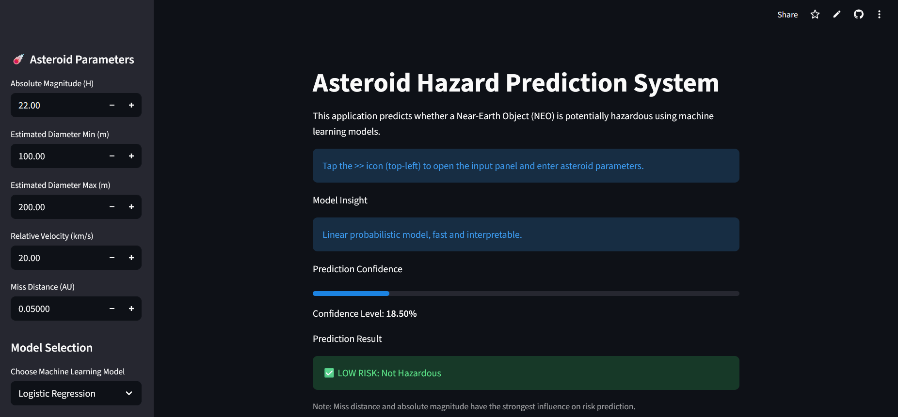
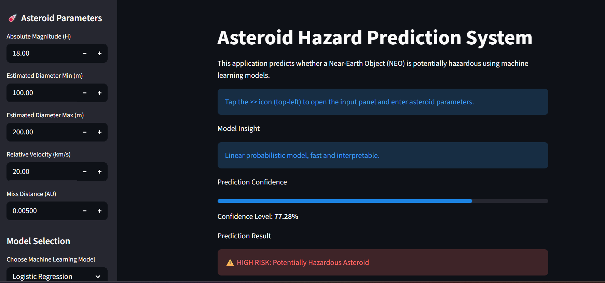

# Asteroid Hazard Prediction System

An end-to-end Machine Learning project that predicts whether a **Near-Earth Object (NEO)** is potentially hazardous based on its physical and orbital characteristics.

This project demonstrates:
- Classification
- Regression
- Clustering
- Model comparison
- Web-based deployment
- Research-oriented documentation

---

## Problem Statement

Near-Earth asteroids pose a potential threat to Earth. Early identification of **Potentially Hazardous Asteroids (PHAs)** is critical for planetary defense.

This project applies multiple machine learning algorithms to predict asteroid hazard status using real astronomical data.

---

## Dataset

- Source: NASA Near-Earth Object (NEO) dataset
- Type: Structured tabular data
- Features include:
  - Absolute magnitude
  - Estimated diameter
  - Relative velocity
  - Miss distance
- Target:
  - `is_potentially_hazardous_asteroid` (Binary)

---

## Machine Learning Techniques Used

### 🔹 Classification
- Logistic Regression
- K-Nearest Neighbors (KNN)
- Support Vector Machine (SVM)
- Decision Tree


### 🔹 Clustering
- K-Means clustering for asteroid grouping

---

## Evaluation Metrics

- Accuracy
- Precision
- Recall
- F1-score
- ROC-AUC

---

## Deployment

- Interactive web application built using **Streamlit**
- Users can input asteroid parameters and receive predictions
- Deployed publicly for live demonstration

---

## Project Structure

asteroid-hazard-prediction/

- data/ # Raw and processed datasets
- notebooks/ # EDA and experiments
- src/ # Core ML pipeline
- app/ # Streamlit web app
- models/ # Trained models
- reports/ # Final research report
- requirements.txt
- README.md


---

## Objectives

- Compare performance of multiple ML models
- Visualize asteroid behavior patterns
- Build an explainable and deployable ML system
- Provide a reproducible research workflow

---

## Future Work

- Deep learning models
- Real-time data integration
- Time-series trajectory prediction
- Automated alert systems

---

## License

This project is licensed under the MIT License.

## Project Report

- **Report:**  
  [Asteroid Hazard Prediction System Using Machine Learning](report/Asteroid_Hazard_Prediction.pdf)

- **Live Demo:**  
  https://asteroid-hazard-prediction-by-snehil.streamlit.app/


## How to Run Locally

1. Clone the repository:
   ```bash
   git clone https://github.com/Snehil7903/asteroid-hazard-prediction.git
   cd asteroid-hazard-prediction

2. (Optional but recommended) Create and activate a virtual environment:

python -m venv venv
source venv/bin/activate   # On Windows: venv\Scripts\activate

3. Install dependencies:

pip install -r requirements.txt

4. Run the Streamlit application:

streamlit run app/app.py

5. Open your browser and go to:

http://localhost:8501

## Application Screenshots

### Main Interface


### Prediction Output


### Asteroid Clustering Visualization
.png)
